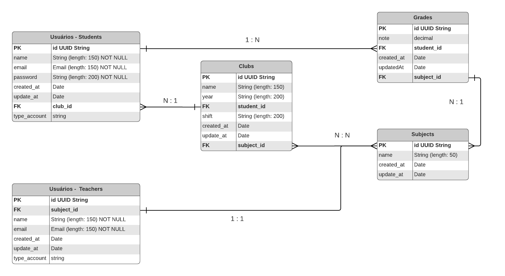

## Desafio - Gerenciador de Escola - Backend

- Para iniciar a aplicação, é necessário realizar os seguintes passos

1. Crie seu ambiente virtual:
```bash
python -m venv venv
```

2. Ative seu venv:
```bash
# linux:
source venv/bin/activate

# windows:
.\venv\Scripts\activate
```

3. Faça a instalação das dependências
```bash
pip install -r requirements.txt
```

4. Crie um arquivo .env utilizando o .env de exemplo e preencher as informações.

5. Crie o seu banco de dados (utilizar algum com postgreSQL) - Beekeeper Studio

6. Execute ao comando python manage.py 

7. inicialize sua aplicação - python manage.py runserver

A documentação da API se encontra no seguinte URL:
http://127.0.0.1:8000/api/docs/

- Diagrama de entidades da aplicação:
- 
